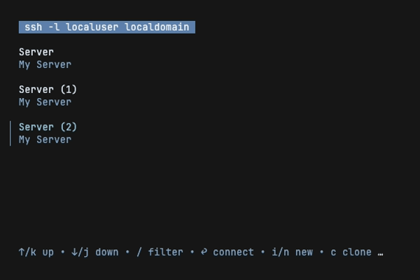

# GOTO - A simple SSH manager #

[](https://raw.githubusercontent.com/grafviktor/goto/master/LICENSE)
[](https://codecov.io/gh/grafviktor/goto)

This tiny app helps to maintain a list of ssh servers. Unlike PuTTY it doesn't incorporate any connection logic, but relying on `ssh` utility which should be installed on your system.

Supported platforms: macOS, Linux, Windows.

## 1. Installation ##

* Download the latest version from the [Releases](https://github.com/grafviktor/goto/releases) section;
* Choose a binary file which matches your platform;
* Place the binary into your user's binary path;
* If you're on Linux or macOS, ensure that the binary has execution permissions (use `chmod +x gg-${YOUR_PLATFORM_TYPE}`);
* Optionally: rename `gg-${YOUR_PLATFORM_TYPE}` to `gg`.

## 2. Functional demo ##

### 2.1. Edit and connect to a remote box ###


### 2.2. Duplicate an existing record ###



### 2.3. Find a requried host easily among all your records ###


## 3. Configuration ##

### 3.1. Command line options ###

* `-f` - application home folder;
* `-l` - log verbosity level. Only `info`(default) or `debug` values are currently supported;
* `-v` - display version and configuration details.

### 3.2. Environment variables ###

* `GG_HOME` - application home folder;
* `GG_LOG_LEVEL` - log verbosity level. Only `info`(default) or `debug` values are currently supported.

## 4. File storage structure ##

Currently you can only store your hosts in a yaml file, which is called `hosts.yaml`. The file is located in your user config folder which exact path depends on a running platform:

* on Linux, it's in `$XDG_CONFIG_HOME/goto` or `$HOME/.config/goto`;
* on Mac, it's in `$HOME/Library/Application Support/goto`;
* on Windows, it's in `%AppData%\goto`.

Usually you don't need to edit this file manually, but sometimes it's much more convenient to edit it into your favorite text editor, than using `goto` utility. The file structure is very simple and self-explanatory:

```yaml
- host:
    title: kernel.org
    description: Server 1
    address: 127.0.0.1
- host:
    title: microsoft.com
    description: Server 2
    address: 127.0.0.1
    network_port: 22
    username: satya
    identity_file_path: /home/user/.ssh/id_rsa_microsoft
```

## 5. [Contributing guidelines](CONTRIBUTING.md) ##

## 6. [Changelog](CHANGELOG.md) ##

## 7. [License](LICENSE) ##
