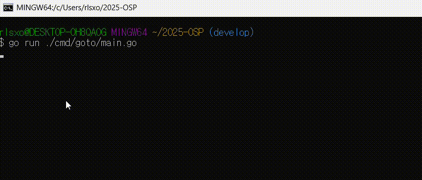

# GOTO - A simple SSH manager #

[](https://raw.githubusercontent.com/grafviktor/goto/master/LICENSE)
[](https://codecov.io/gh/grafviktor/goto)

This tiny app helps to maintain a list of SSH servers. Unlike PuTTY, it doesn't incorporate any connection logic, relying on the `ssh` utility which should be installed on your system.

Supported platforms: macOS, Linux, Windows.

## Goal ##

  기존의 프로그램은 방향키를 사용하여 SSH 서버를 선택한 후 엔터키를 입력하여 접속하는 방식만 지원했습니다. <br><br>본 프로젝트에서는 마우스 클릭을 통해 서버를 선택하고 접속할 수 있는 기능을 추가하여, 사용자의 편의성을 더욱 향상시켰습니다. <br><br>이로 인해 사용자들은 더 직관적이고 빠르게 SSH 서버에 접속할 수 있게 되었습니다. <br><br>하지만, 터미널 환경(PuTTY 등)에 따라 마우스 이벤트가 지원되지 않을 수 있습니다.


## Requirements ##

### 기술 스택 및 라이브러리
- Go 언어
- Bubble Tea: TUI 기반 UI 라이브러리
- os 패키지: ssh_config 파일 파싱
- Docker: 개발 환경 격리 및 배포

### 마우스 클릭 기능 세부 구현
- 'tea.MouseMsg`로 마우스 이벤트 처리
- 클릭 좌표 기반 항목 선택 (itemHeight, listOffset 사용)
- 클릭된 좌표를 화면의 항목 크기에 맞게 변환하여, 해당 항목을 선택하도록 구현
- 더블 클릭 감지: 두 번의 클릭 사이 시간 차이를 확인하여, 더블 클릭이 발생했을 때 해당 호스트에 대   한 SSH 연결을 시도
(더블클릭 기능 코드는 구현했으나 작동하지 않아 현재는 한 번 클릭으로 접속 가능한 상태)

## How to Install & Run ##

### 1. Repo 클론 및 디렉토리 이동
```bash
   git clone https://github.com/ts9744/2025-OSP.git
   cd 2025-OSP
```
   
### 2. Docker 이미지 빌드
```bash
   docker build \
  --build-arg VERSION=1.0.0 \
  --build-arg BRANCH=feature/Click_Function \
  -t final_2021040024:v1 \
  .
```  
### 3. Docker 컨테이너 실행 및 진입
```bash
   docker run -it final_2021040024:v1 /bin/bash
```
### 4. 도구 버전 확인 (컨테이너 내부)
```bash
   git --version
   go version
   make --version
   gg -v
```
### 5. GO 수동 설치
```bash
   wget https://go.dev/dl/go1.22.3.linux-amd64.tar.gz
```
### Case1.압축 해제 (Sudo Used)
```bash
   sudo tar -C /usr/local -xzf go1.22.3.linux-amd64.tar.gz
```
### Case2. 설치용폴더 생성, 압축해제 (Sudo Unused)
```bash
   mkdir -p $HOME/local
   tar -C $HOME/local -xzf go1.22.3.linux-amd64.tar.gz
```
### 6. 환경 변수 설정
```bash
   echo 'export GOROOT=$HOME/local/go' >> ~/.bashrc
   echo 'export PATH=$GOROOT/bin:$PATH' >> ~/.bashrc
   source ~/.bashrc
```
### 7. 설치 확인
```bash
   go version
```
### 8. 프로그램 실행:
```bash
   go run main.go
```
### 9. 프로그램 종료 방법:
   프로그램 내에서 esc를 누른 뒤, y 입력 후 Enter


## Functional demo ##
방향키로 서버 선택 후 Enter로 접속하는 프로그램


상단의 GIF: 기존의 프로그램(방향키로 서버 선택, 접속)  

하단의 GIF: 마우스로 서버 선택, 접속 기능을 추가





### Command line options ###

* `-f` - application home folder;
* `-l` - log verbosity level. Only `info`(default) or `debug` values are currently supported;
* `-v` - display version and configuration details.

## Directory Structure ##
```bash
📦2025-OSP/
├── CHANGELOG.md             
├── codecov.yml              
├── demo/                    
├── build/                   * 패키징 관련 스크립트/파일
│   └── deb/
│       ├── Dockerfile       * `.deb` 빌드를 위한 Docker 설정
│       └── goto.control      
├── cmd/                     
│   └── goto/
│       └── main.go          * 실행 파일
├── internal/                * 내부 코드
├── e2e/                     
├── Makefile                 
├── go.mod, go.sum           * Go 모듈 의존성 관리 파일
├── install/                 
├── LICENSE                  * MIT 라이선스 텍스트
├── README.md                * 프로젝트 설명, 빌드·실행 가이드
└── CONTRIBUTING.md          
```
### 주요 디렉토리 설명
* `demo/` : 앱 실행 GIF, 스크린샷, 데모 동영상 등 사용자 안내용 파일
* `build/deb/`  
├── `Dockerfile`: 패키지 빌드 컨테이너 설정
├── `goto.control`: 패키지 메타데이터 정의
* ` cmd/goto/`: Go 애플리케이션의 루트 디렉토리
├── `main.go`: 프로그램 실행 파일


## [Contributing guidelines](CONTRIBUTING.md) ##

## [License](LICENSE) ##
