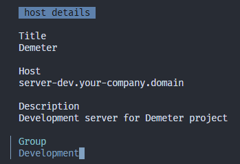
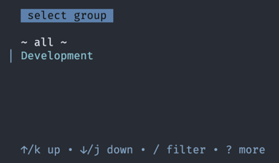

## How to assign a group to a host ##

The application supports grouping. You can assign a group to a host and then filter hosts by group name. This feature is supported for both storage types: yaml file and ssh_config. The way you assign a group to a host depends on the storage type you use.

To switch between groups, you can use the `z` key. The group which is called `~ all ~` contains all hosts.

### Default storage (Yaml) ###

For yaml storage, you can assign a group to a host by adding a value to the 'Group' field using the application UI.



Then save the host (`Ctrl+S`) and when on the main screen type `z` to display the groups list and select the group which you just created.



It can be tedious to assign a group to each host if you have lots of entries. The alternative approach would be to use your favorite text editor and tweak the hosts file directly. The path to the hosts file can be found in `gg -v` output.

1. Find the path to the hosts file:

    ```bash
    $ gg -v
    ...
    App home: /home/roman/.config/goto
    ...
    ```

2. Open the hosts file in your favorite text editor:

    ```bash
    $ vim /home/roman/.config/goto/hosts.yaml
    ```

3. Add the 'Group' field to the host entries you want to assign to a group. For example:
    ```yaml
    - host:
        address: server-dev.your-company.domain
        description: Development server for Demeter project
        group: Development
        title: Demeter
    ```

### SSH storage (ssh_config) ###

Goto does not allow you to edit ssh_config file directly. You should edit ssh_config file using your favorite text editor and add a meta comment called `# GG:GROUP` for your host entries.

1. Open ssh_config file in your favorite text editor:

    ```bash
    $ vim ~/.ssh/config
    ```

2. Add `# GG:GROUP` comment to the host entries you want to assign to a group. For example:

    ```
    Host Demeter
        # GG:GROUP: Development
        # GG:DESCRIPTION: Development server for Demeter project
        HostName server-dev.your-company.domain
    ```

Read more about ssh_config file usage in [this document](SSH_CONFIG.md).