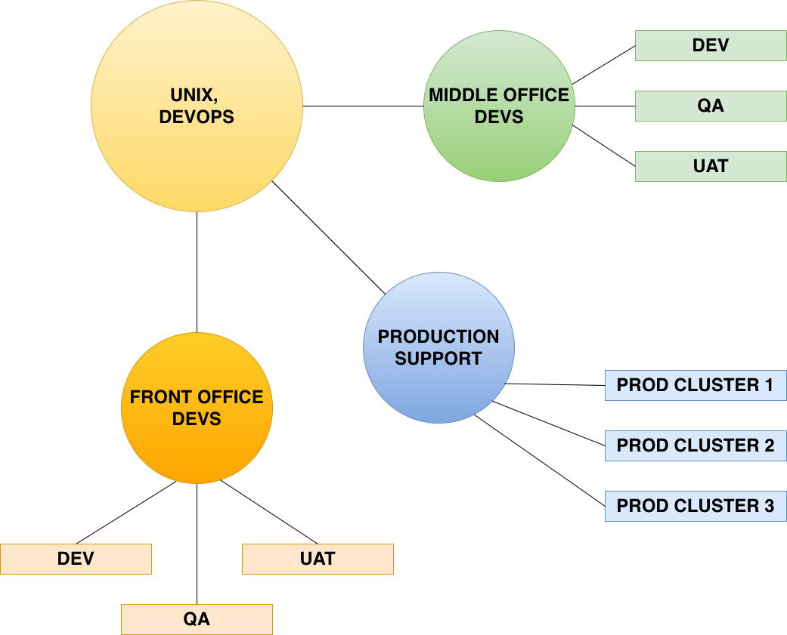

## REMOTE SSH CONFIG ##

The application can load ssh_config file directly from a URL. This feature helps large IT departments distribute a centrally managed SSH configuration across different IT teams. A company’s VCS server is an ideal place to store and maintain this configuration.

The diagram below illustrates a typical server-access hierarchy: Unix and DevOps teams often require access to all company servers, while Development and Production Support teams only need access to specific subsets.

This document provides an example of how to implement such a structure using GOTO and ssh_config files.



Thanks to ssh_config file format, it supports including additional configuration files. GOTO extends this capability even further by allowing included files to be stored remotely.

Here is an example of what a UNIX or DevOps team’s ssh_config might look like when implementing the structure shown in the diagram.

```
######## CONFIG ROOT ########
# Root file includes all other files.
# This file is to be used by Unixes and DevOpses,
# as they want to have access to all servers.

Include front_office_config
Include middle_office_config
Include production_support_config
```

Devs and Production Support folks will have their own ssh_config files, which will include only the relevant files. You can see examples of those files below.

<details>
<summary>Click to see the included files</summary>

```
############ MO DEV ############
# This file is to be used by Middle Office Devs.
# They're not interested in accessing other servers.

Host MIDDLE_OFFICE.DEV1
  # GG:GROUP: MIDDLE OFFICE DEV
  # GG:DESCRIPTION: Location: NY
  User mo-developer
  HostName dev-host1.localdomain

Host MIDDLE_OFFICE.DEV2
  # GG:GROUP: MIDDLE OFFICE DEV
  # GG:DESCRIPTION: Location: London
  User mo-developer
  HostName dev-host2.localdomain

Host MIDDLE_OFFICE.QA1
  # GG:GROUP: MIDDLE OFFICE DEV
  # GG:DESCRIPTION: Location: NY
  User mo-developer
  HostName qa-host1.localdomain

Host MIDDLE_OFFICE.QA2
  # GG:GROUP: MIDDLE OFFICE DEV
  # GG:DESCRIPTION: Location: London
  User mo-developer
  HostName qa-host2.localdomain

Host MIDDLE_OFFICE.UAT1
  # GG:GROUP: MIDDLE OFFICE DEV
  # GG:DESCRIPTION: Location: NY
  User mo-developer
  HostName uat-host1.localdomain

Host MIDDLE_OFFICE.UAT2
  # GG:GROUP: MIDDLE OFFICE DEV
  # GG:DESCRIPTION: Location: London
  User mo-developer
  HostName uat-host2.localdomain
```

```
############ FO DEV ############
# This file is to be used by Front Office Devs.
# They're not interested in accessing other servers.

Host FRONT_OFFICE.*
	User fo-developer

Host FRONT_OFFICE.DEV
  # GG:GROUP: FRONT OFFICE DEV
  # GG:DESCRIPTION: Location: NY
  HostName dev-host.localdomain

Host FRONT_OFFICE.QA
  # GG:GROUP: FRONT OFFICE DEV
  # GG:DESCRIPTION: Location: NY
  HostName qa-host.localdomain

Host FRONT_OFFICE.UAT
  # GG:GROUP: FRONT OFFICE DEV
  # GG:DESCRIPTION: Location: NY
  HostName uat-host.localdomain
```

```
######## PROD SUPPORT #######
# This file is to be used by Front Office Devs.
# They're not interested in accessing other servers.

Host PROD.CLUSTER.*
	User prod-support

Host PROD.CLUSTER.FRONT_OFFICE
  # GG:GROUP: PRODUCTION SUPPORT
  # GG:DESCRIPTION: Location: NY
  HostName prod-host1.localdomain

Host PROD.CLUSTER.MIDDLE_OFFICE
  # GG:GROUP: PRODUCTION SUPPORT
  # GG:DESCRIPTION: Location: London
  HostName prod-host2.localdomain

Host PROD.CLUSTER.FRONT_OFFICE_LOG
  # GG:GROUP: PRODUCTION SUPPORT
  # GG:DESCRIPTION: Location: NY
  RequestTTY yes
  RemoteCommand less ${HOME}/service1/service.log
  HostName prod-host1.localdomain

Host PROD.CLUSTER.MIDDLE_OFFICE_LOG
  # GG:GROUP: PRODUCTION SUPPORT
  # GG:DESCRIPTION: Location: London
  RequestTTY yes
  RemoteCommand less ${HOME}/service2/service.log
  HostName prod-host2.localdomain
```

</details>


In order to see this configuration in action, you can run GOTO with the following parameters. **Don't forget that you can switch between hosts groups using `z` key when the application is running. Otherwise you may see only a subset of hosts belonging to the active group!**

```bash
# Want to be a Production Support engineer?
gg -s "https://raw.githubusercontent.com/grafviktor/goto/refs/heads/develop/docs/example/production_support_config"

# Want to be a Unix or DevOps expert and see all company's boxes? No problem!
gg -s "https://raw.githubusercontent.com/grafviktor/goto/refs/heads/develop/docs/example/root_config"
```

To set ssh_config URL permanently, please use --set-ssh-config-path parameter.

```bash
gg --set-ssh-config-path "https://raw.githubusercontent.com/grafviktor/goto/refs/heads/develop/docs/example/root_config"
```

The limitation of this approach is that GOTO cannot edit host entries loaded from remote ssh_config files. If you need to adjust hostnames before connecting or create new entries on the fly, please consider using YAML storage which is described in project [README](../README.md#41-yaml-storage-location-and-structure) file.
